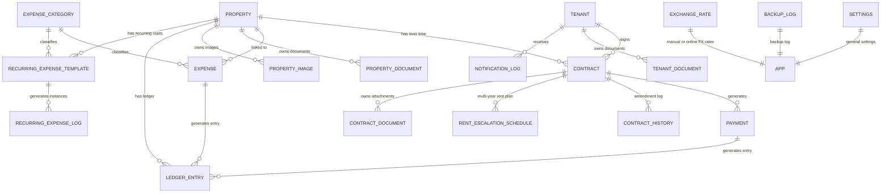
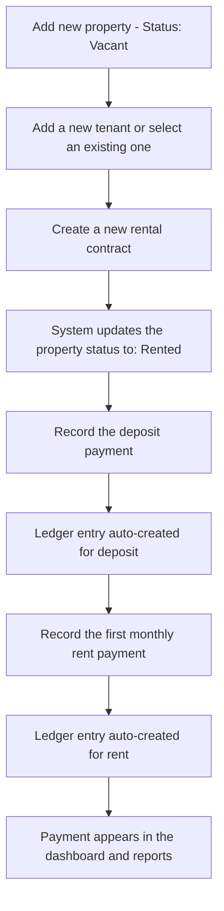
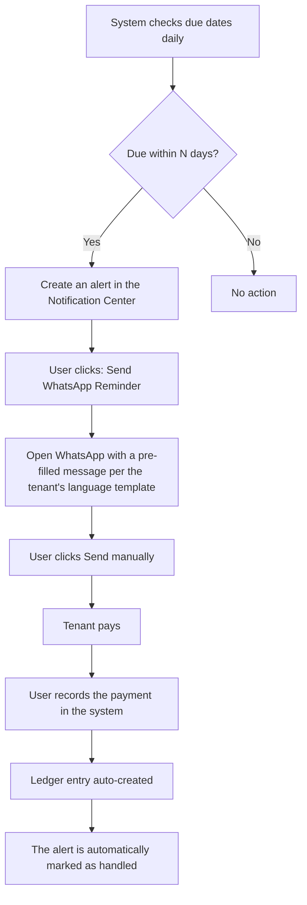
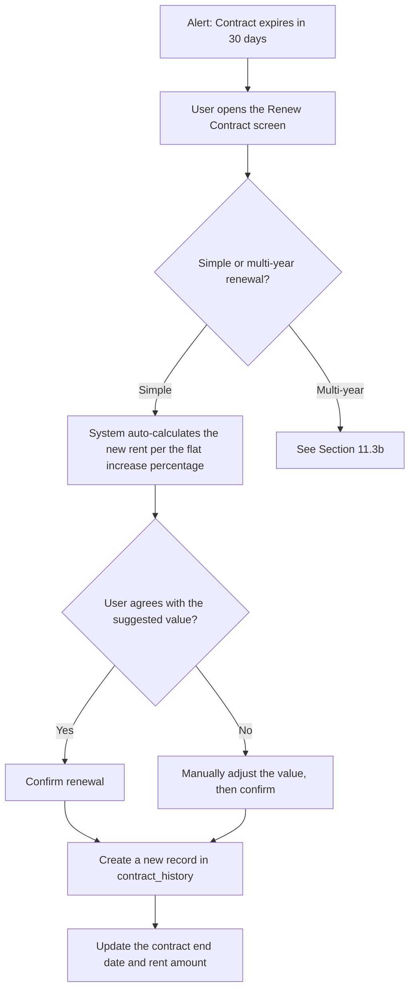
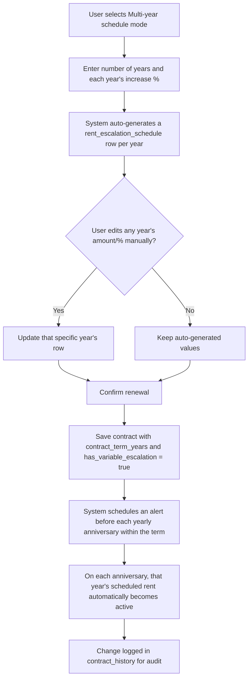
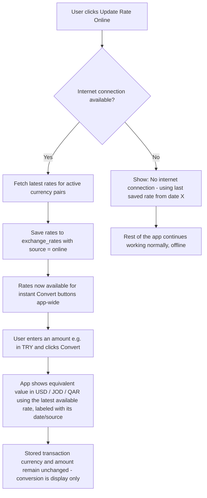
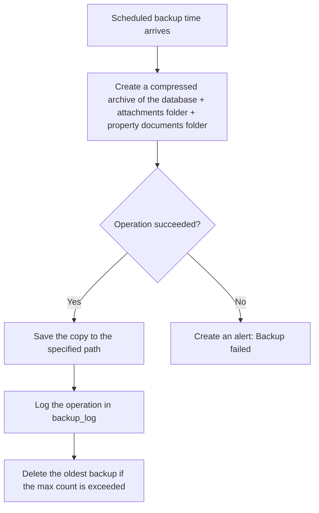
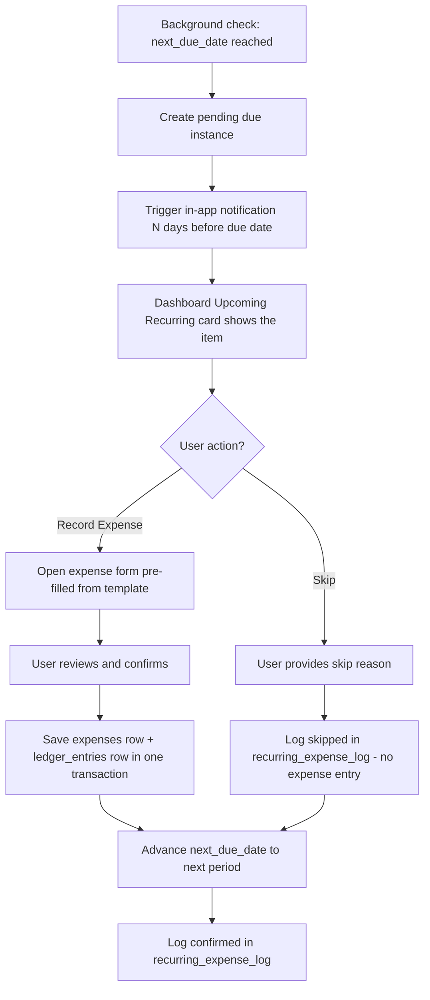
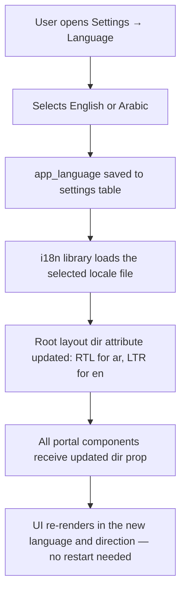
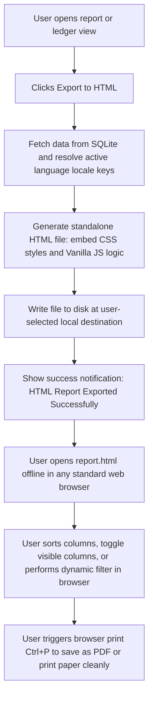

# Software Requirements Specification (SRS) & Product Specification
## Desktop Application for Managing Rented Commercial Stores and Residential Apartments

**Version:** 1.1
**Date:** July 2026
**Target Platform:** Windows Desktop (Offline)
**Interface Language:** Arabic-first, bilingual (Arabic + English) — see Section 2.2 and Section 6

---

## 1. Executive Summary

This application is an **offline-first** desktop system designed to help property owners manage rented commercial stores and residential apartments — from property and tenant data, through multi-year rental contracts with variable rent increases, to income, expense, and financial reporting. The app runs fully without an internet connection for all core operations; the only optional exception is a one-click "update rate online" feature that, when the machine happens to be connected to the internet, refreshes currency exchange rates from a live source (see Section 2.5) — everything else, including using previously-saved rates, works with no connection at all.

The app targets non-technical users. It uses an **Arabic-first, bilingual interface** (Arabic is the default language; English is fully available via a language switcher in Settings), with full RTL layout when Arabic is active and LTR when English is active, minimal manual typing, large and clear controls, and proactive alerts (contract renewals, rent due dates, overdue payments, recurring expense reminders, document expiry alerts).

All data is stored locally (SQLite database), with automatic and manual backup support, and every report can be exported to Excel and as an interactive HTML report with professional formatting ready for printing or viewing.

This document is written to be **directly implementation-ready** for an AI coding assistant (such as Claude Code), and includes: functional and non-functional requirements, user personas, user stories, information architecture and navigation, a database diagram and schema, screen-by-screen specifications, business and validation rules, report and Excel export specifications, backup and error-handling strategy, and a future roadmap.

> **Note:** This specification document is written in English for the development team's reference. **The application's user interface is Arabic-first with full RTL layout**, but English is fully supported via i18n translation files (`ar.json` / `en.json`). See Section 2.2 and the Non-Functional Requirements in Section 6 for the complete bilingual architecture requirements.

### 1.1 Core Value Proposition
| Feature | Value to the User |
|---|---|
| Offline-first operation | No worries about network outages or data leaking to external servers; an internet connection is only ever used, briefly and optionally, to refresh exchange rates |
| Arabic-first bilingual interface | Easy to use for a non-technical Arabic-speaking owner; English available for assistants or accountants who prefer it |
| Due-date and renewal alerts | Reduces missed rent collection or contract renewals |
| Recurring expense automation | Never forget monthly cleaning, annual insurance, or quarterly municipal taxes |
| Financial ledger | Complete, auditable transaction journal — balances can always be reconstructed from scratch |
| Property documents vault | Store deeds, insurance policies, utility contracts, and maintenance records against each property |
| Professional Excel & HTML export | Easily share reports with an accountant or partner, or view them interactively in any browser |
| Automatic backup | Protects data from loss |

---

## 2. Product Overview and Goals

### 2.1 The Problem
Small and medium property owners (5–100 units) currently manage their properties via paper ledgers or scattered Excel files, leading to:
- Forgotten rent due dates or contract renewal deadlines.
- Difficulty knowing the true profitability of each property.
- Lost invoices and documents.
- Recurring costs (insurance, cleaning, municipal taxes) missed or paid late.
- No auditable financial history — balances are guessed, not reconstructed.
- Difficulty preparing reports for an accountant or official bodies.

### 2.2 The Solution
A single, simple, offline desktop application that brings together all property, tenant, contract, financial transaction, recurring expense, and document data in one place, with automatic reminders and ready-made reports.

**Language and direction:** The interface is **Arabic-first**. Arabic is the default language on first launch, with a full RTL layout. The user may switch to English at any time from Settings → Language, which flips the layout to LTR. **All user-facing text — labels, buttons, placeholders, error messages, tooltips, report headers, and notification templates — must be served from i18n translation keys** (`ar.json` / `en.json`). No hardcoded text strings are permitted in any UI component. This is a hard architectural requirement, not a localization detail.

Since the target users are Arabic-speaking non-technical owners in Jordan (and properties may also be in Turkey, Qatar, and other countries), Arabic is optimized as the primary experience. English support ensures that assistants, accountants, and international partners can operate the app without friction.

### 2.3 Product Goals
1. Accurate tracking of every property (store/apartment) and its status (rented/vacant).
2. Complete management of tenant profiles and contracts.
3. Recording every income and expense transaction linked to the property and tenant.
4. Maintaining an immutable financial ledger so balances can always be reconstructed — never relying on derived values.
5. Automating recurring costs (cleaning, insurance, municipal taxes) with scheduling and reminders.
6. Securely storing property documents (deeds, insurance policies, utility contracts, maintenance records) linked to each property.
7. Providing a comprehensive financial view (dashboard + reports).
8. Alerting the user to important dates (due dates, renewals, recurring expenses, document expiry, backups).
9. Exporting every report to Excel and interactive HTML format with professional quality in both Arabic and English.
10. Protecting data through regular, easily restorable backups.

### 2.4 Scope
**In scope:** Managing properties for a single owner (single-user mode), running fully locally on a Windows machine. The owner's properties may be located in **different countries** (e.g. Jordan, Turkey, Qatar), each with its own local currency, address format, and tenant nationality/language — see Section 2.5.

**Out of scope (for the current release, part of the future roadmap):** Multi-user support, cloud sync, a companion mobile app, WhatsApp Business API (automatic send without manual trigger), official electronic invoicing integration with government systems, SMS sending. Direct PDF export from within the app is a Phase 4 roadmap item.

### 2.5 Multi-Country & Multi-Currency Support

This is a cross-cutting requirement that affects nearly every module, since the owner's portfolio spans multiple countries (e.g. Jordan, Turkey, Qatar) rather than a single country/currency.

| Aspect | Requirement |
|---|---|
| Property-level country | Every property record stores its own **country** (selected from a configurable list, pre-populated with Jordan, Turkey, Qatar, and extensible to others) |
| Property-level currency | Every property record stores its own **local currency** (e.g. JOD for Jordan, TRY for Turkey, QAR for Qatar). Rent, deposit, income, and expenses for that property are always entered and stored in that property's local currency — never force-converted at entry time |
| Exchange rate updates | The app is offline-first, but includes an **optional "Update Rate Online"** button (in Settings and inline wherever an amount is entered) that fetches current market exchange rates from a public source when the machine happens to have internet access at that moment. If there is no connection, the app simply falls back to the most recent previously-saved rate (whether that rate was entered manually or fetched online earlier) and clearly shows the date it's from — the app never blocks or requires internet for any core function |
| Instant amount conversion | Anywhere the user enters a monetary amount (e.g., a rent payment in Turkish Lira), a "Convert" control lets them instantly see that amount's equivalent value in USD, JOD, QAR, or any other active currency, computed from the latest available rate. This conversion is **for reference/display only** — it never changes the currency or amount actually stored for that transaction (see BR-13); the transaction always keeps the currency it was entered in |
| Rate history & source tracking | Every exchange rate, whether entered manually or fetched online, is saved with its date and source (`manual` or `online`) in the `exchange_rates` table (Section 8), so the user can always see which rate and date a given conversion or consolidated report used |
| Reference currencies | In addition to each property's local currency (JOD, TRY, QAR, etc.), **USD** is available as a standard reference/target currency for instant conversions and for the optional consolidated portfolio view, since it's commonly used as a stable benchmark across these markets |
| Per-currency reporting (default) | All reports default to grouping and totaling **by currency** (i.e., a portfolio with JOD, TRY, and QAR properties shows three separate subtotals, never silently summed together) |
| Optional consolidated view | The user may optionally view a **consolidated portfolio total** converted into one "reporting currency" of their choice, using the most recently entered exchange rate for each currency pair. Any consolidated figure is clearly labeled with the conversion date/rate used, since it is an approximation, not a live rate |
| Address format | The address field adapts its sub-fields per country context (e.g. city/district for Jordan and Turkey, zone/street for Qatar) but remains a flexible free-text-friendly structure rather than rigid per-country templates, to avoid over-engineering |
| Phone number formats | Phone number validation accepts Jordanian (+962), Turkish (+90), Qatari (+974), and generic international formats, since tenants and vendors may be based in any of these countries |
| Tenant nationality/language | The existing `preferred_language` field on tenants (Arabic/Turkish/English) already supports the mix of nationalities expected across these markets |
| Expense categories per country | Category names remain user-customizable (Section 5.6) since categories like "Municipality Fee" or VAT-related expenses differ in name and applicability by country; no country-specific hardcoded tax logic is built in |

---

## 3. User Personas

### 3.1 Persona 1: Abu Mohammad — Traditional Property Owner
- **Age:** 55
- **Technical background:** Very limited; uses the phone only for WhatsApp and calls.
- **Number of properties:** 12 apartments and 3 commercial stores.
- **Needs:** A very simple Arabic interface, large buttons, WhatsApp reminders for due dates, no need to learn accounting terminology.
- **Pain points:** Forgets contract renewal dates, relies on a paper ledger, doesn't know his true profits, pays recurring bills late.

### 3.2 Persona 2: Sarah — Property Manager for a Family Portfolio
- **Age:** 34
- **Technical background:** Moderate; uses Excel and WhatsApp Business.
- **Number of properties:** 40 units (stores and apartments) inherited from the family.
- **Needs:** Accurate monthly reports to share with her siblings as shareholders, Excel export, expense tracking by category, a clear document vault for deeds and insurance.
- **Pain points:** Difficulty distributing profits among partners without precise, documented figures; losing track of property insurance renewal dates.

### 3.3 Persona 3: Accountant / Administrative Assistant
- **Age:** 28
- **Technical background:** Good; works with data daily; may prefer the English interface.
- **Role:** Enters data on behalf of the owner, prepares monthly and annual reports, reconciles the ledger.
- **Needs:** Fast data entry (keyboard shortcuts), quick search, accurate exportable/printable reports, full ledger audit trail.

---

## 4. User Stories

### 4.1 Dashboard
- As a property owner, I want to see my net monthly profit as soon as I open the app, so I know my financial standing without manual calculations.
- As a property owner, I want to see a list of overdue rents, so I can follow up on collecting them quickly.

### 4.2 Property Management
- As a property owner, I want to add a new commercial store with its basic data quickly, so I can start renting and tracking it.
- As a property owner, I want vacant units highlighted in a different color, so I know where to focus marketing efforts.

### 4.3 Tenant Management
- As a property owner, I want to save a copy of the tenant's ID within their file, so I don't have to search for it in paperwork later.
- As a property owner, I want to specify the tenant's communication language (Arabic/Turkish/English), so I can send them alerts in their language.

### 4.4 Contracts
- As a property owner, I want an alert 30 days before a contract ends, so I can decide whether to renew.
- As a property owner, I want the system to automatically calculate the annual rent increase upon renewal based on a percentage I set.

### 4.5 Income and Expenses
- As a property owner, I want to record a partial rent payment, so I can reflect reality when a tenant pays part of the amount.
- As a property owner, I want to categorize every expense (electricity, maintenance, municipality...) so I know where my money is going.

### 4.6 Reports and Export
- As a property owner, I want to export a profit-and-loss report for a specific property to Excel, so I can share it with my accountant.
- As a co-owner of a property, I want a profitability report for each property individually, so I know my exact share.

### 4.7 Backup
- As a property owner, I want the app to take an automatic daily backup, so I don't lose my data if my device fails.

### 4.8 Notifications
- As a property owner, I want to send a WhatsApp reminder to the tenant three days before the rent due date, so I reduce payment delays.

### 4.9 Financial Ledger
- As a property owner, I want every payment and expense automatically recorded in a single chronological ledger, so my accountant can verify the exact balance without asking me for paper receipts.
- As a property owner, I want to reconstruct any property's balance at any historical date, so I can prove my financial history if ever questioned.
- As an accountant, I want to export the full ledger for any period to Excel, so I can reconcile it with the bank statement.

### 4.10 Recurring Expenses
- As a property owner, I want to define monthly cleaning as a recurring expense for an apartment, so the app reminds me every month without me having to re-enter it manually.
- As a property owner, I want to set annual insurance renewal as a recurring item, so I get an alert before the policy expires and the system pre-fills the expense form.
- As a property owner, I want to pause a recurring expense while a property is vacant, so no spurious entries are created.

### 4.11 Property Documents
- As a property owner, I want to attach the property deed to the property record, so I can find it instantly without searching paper files.
- As a property owner, I want an alert before an insurance policy attached to a property expires, so I can renew it on time.
- As a property owner, I want to store utility contracts against the relevant property, so maintenance staff and accountants know the account details.

### 4.12 Interactive HTML Reports
- As a property owner, I want to export any financial report as an interactive HTML page, so I can open and navigate it on any mobile device or computer without needing Excel.
- As a partner or stakeholder, I want to filter and sort the exported report directly inside my web browser, so I can easily analyze the data on the go.
- As a property manager, I want to print the HTML report cleanly from the browser or save it directly as a PDF.


---

## 5. Functional Requirements

### 5.1 Module 1: Dashboard

| ID | Requirement |
|---|---|
| FR-DASH-01 | Display total current-month income in a summary card at the top of the dashboard, **grouped and shown per currency** (e.g. a separate line for JOD, TRY, QAR) rather than summed across currencies |
| FR-DASH-02 | Display total current-month expenses in a summary card, grouped per currency the same way |
| FR-DASH-03 | Display net profit (income − expenses) per currency in a distinct color (green for profit, red for loss); an optional consolidated total (converted to the chosen reporting currency) is shown separately and clearly labeled as an approximation |
| FR-DASH-00 | A "Country" filter/tab at the top of the dashboard lets the user narrow the whole dashboard to a single country's properties, or view "All Countries" (grouped per currency as above) |
| FR-DASH-04 | Display an "Upcoming Rent Due" list for the next 7 days |
| FR-DASH-05 | Display an "Overdue Payments" list sorted from oldest to newest |
| FR-DASH-06 | Display the count of occupied vs. vacant units (pie chart) |
| FR-DASH-07 | Display a line chart of income trend over the last 12 months |
| FR-DASH-08 | Display a line chart of expense trend over the last 12 months |
| FR-DASH-09 | Display a "Recent Activities" list (last 10 create/edit operations) |
| FR-DASH-10 | Each card is clickable to navigate to the related detail screen |
| FR-DASH-11 | The dashboard updates instantly on any data change (without needing a restart) |
| FR-DASH-12 | Display an "Upcoming Recurring Expenses" card showing the next 7 days of scheduled recurring costs |
| FR-DASH-13 | Display an "Expiring Documents" card listing property documents whose expiry date falls within the next 30 days |

### 5.2 Module 2: Property Management

| ID | Requirement |
|---|---|
| FR-PROP-01 | Add a new property (apartment or store) with fields: name, code, **country**, address, type, area, status, monthly rent, **currency**, notes, optional images |
| FR-PROP-02 | Auto-generate the property code (editable) in a format like `APT-001` or `SHOP-001`, optionally prefixed by a country code (e.g. `JO-APT-001`, `TR-SHOP-004`) |
| FR-PROP-03 | Edit an existing property's data |
| FR-PROP-04 | Delete a property (with a check that no linked contracts/transactions exist, or archive instead of hard delete) |
| FR-PROP-05 | Change property status: vacant / rented / under maintenance |
| FR-PROP-06 | Display a list of all properties with filtering by type, status, **and country** |
| FR-PROP-09 | When a country is selected, auto-suggest the country's default currency (editable if a property is priced in a different currency by exception) |
| FR-PROP-07 | Display a property detail page combining: property data, current contract, tenant history, payment history, expense history, net profitability, **documents vault**, **recurring expenses** |
| FR-PROP-08 | Support attaching multiple images to a property |

### 5.3 Module 3: Tenant Management

| ID | Requirement |
|---|---|
| FR-TEN-01 | Add a new tenant with fields: full name, national ID, phone numbers, email, address, emergency contact, communication language (Arabic/Turkish/English), notes |
| FR-TEN-02 | Attach documents (ID copy, contract copy, other files) in PDF/JPG/PNG/DOCX formats |
| FR-TEN-03 | Edit/delete tenant data (with a check for active contract links before deletion) |
| FR-TEN-04 | Display a complete tenant record: past and current contracts, payments, outstanding balance |
| FR-TEN-05 | Search for a tenant by name, national ID, or phone number |
| FR-TEN-06 | Link a tenant to more than one contract/property over time (historical record) |

### 5.4 Module 4: Rental Contracts

| ID | Requirement |
|---|---|
| FR-CON-01 | Create a new contract: start date, end date, monthly rent, deposit amount, payment frequency (monthly/quarterly/semi-annual/annual), payment method, contract status |
| FR-CON-02 | Link a contract to one property and one tenant (or more as co-tenants — future version) |
| FR-CON-03 | Automatic alert before contract expiration, with the number of days configurable in Settings (default 30 days) |
| FR-CON-04 | Support "renewal" with automatic calculation of an annual increase by a preset flat percentage (simple case), with manual override at renewal time |
| FR-CON-05 | Contract statuses: active, expired, under renewal, cancelled |
| FR-CON-06 | Attach a scanned copy of the signed contract (stored in `contract_documents`) |
| FR-CON-07 | Maintain a full historical record of every renewal and amendment to the contract (audit trail in `contract_history`) |
| FR-CON-08 | When a contract is cancelled before its end date, record the cancellation reason and date |
| FR-CON-09 | Support defining a **multi-year renewal term** (e.g. a 3-year or 5-year renewal) with a **variable rent-escalation schedule** — a distinct rent amount and/or increase percentage for each year of the term, rather than one flat percentage applied uniformly every year (e.g. Year 1: 3,000 JOD, Year 2: +5%, Year 3: +7%, Year 4: +4%) |
| FR-CON-10 | Auto-generate the full per-year schedule of rent amounts from a starting rent plus a sequence of yearly increase percentages the user enters; every generated year's rent remains individually editable afterward |
| FR-CON-11 | On each contract anniversary within a multi-year term, the system automatically applies that year's scheduled rent to future due-date and payment calculations, and logs the change in `contract_history` — the user is not required to manually "re-renew" the contract every single year |
| FR-CON-12 | Send an alert ahead of **every** upcoming anniversary/escalation step within a multi-year term (not only at the final contract end date), so the owner knows a rent change is about to take effect and can inform the tenant in advance |
| FR-CON-13 | Allow converting a simple single-year contract into a multi-year one at renewal time, and vice versa (collapsing a multi-year schedule back to a flat annual increase) if the owner's arrangement with the tenant changes |

### 5.5 Module 5: Income Management

| ID | Requirement |
|---|---|
| FR-INC-01 | Record a rent payment: date, amount, property, tenant, payment method, receipt number, notes |
| FR-INC-01b | Provide an instant "Convert" button next to the amount field showing the equivalent value in USD, JOD, QAR, and other active currencies, using the latest available exchange rate (see Module 14) — for reference only, without altering the stored payment currency/amount |
| FR-INC-02 | Record the deposit payment separately at contract start, tracking its status (held / returned / partially forfeited / forfeited) |
| FR-INC-03 | Record other income (not rent), such as late fees or compensation |
| FR-INC-04 | Support partial payments with automatic calculation of the remaining balance |
| FR-INC-05 | Auto-generate a sequential receipt number (customizable in Settings) |
| FR-INC-06 | Display a payment history per tenant/property with the ability to print as a receipt |
| FR-INC-07 | Every saved payment automatically generates a corresponding entry in the `ledger_entries` table (FR-LED-02) |

### 5.6 Module 6: Expense Management

| ID | Requirement |
|---|---|
| FR-EXP-01 | Record an expense: date, property (or "general" if not linked to a specific property), category, vendor, amount, currency, notes, receipt attachment |
| FR-EXP-01b | Provide the same instant "Convert" button next to the expense amount field as on the payment screen (see FR-INC-01b) |
| FR-EXP-02 | Default categories: maintenance, electricity, water, municipality, taxes, insurance, cleaning, repairs, administrative, miscellaneous |
| FR-EXP-03 | Allow adding new custom categories |
| FR-EXP-04 | Link an expense to a specific property (for property profitability) or classify it as a general expense |
| FR-EXP-05 | Edit/delete a recorded expense with an audit trail; deletion is a soft-void (`is_voided = true`) with a required reason |
| FR-EXP-06 | Every saved expense automatically generates a corresponding entry in the `ledger_entries` table (FR-LED-02) |

### 5.7 Module 7: Reports

| ID | Requirement |
|---|---|
| FR-REP-01 | Select report period: daily, weekly, monthly, quarterly, yearly, or a custom date range |
| FR-REP-02 | Income report: breakdown of all payments received during the period |
| FR-REP-03 | Expense report: breakdown of all expenses, grouped by category |
| FR-REP-04 | Profit & Loss (P&L) report per property and for the whole portfolio |
| FR-REP-05 | Property profitability report: properties ranked from most to least profitable |
| FR-REP-06 | Tenant payment history report |
| FR-REP-07 | Outstanding balances report |
| FR-REP-08 | Vacancy report |
| FR-REP-09 | Upcoming contract expiration and rent-escalation report (covers both final contract-end dates and mid-term yearly escalation steps for multi-year contracts) |
| FR-REP-10 | Preview the report in-app before exporting or printing |
| FR-REP-11 | Financial Ledger report: a full chronological listing of all ledger entries for a selected property and period, showing running balance (see Section 14.9) |
| FR-REP-12 | Recurring Expenses Schedule report: all active recurring templates with their next due dates (see Section 14.10) |
| FR-REP-13 | Document Expiry report: all property documents with expiry dates, sorted by nearest expiry (see Section 14.11) |

### 5.8 Module 8: Excel and Interactive HTML Export

| ID | Requirement |
|---|---|
| FR-XLS-01 | Export any report from the app to an Excel file (.xlsx) with one click |
| FR-XLS-02 | Formatting includes: full RTL orientation when the app is in Arabic mode, LTR when in English mode; clear font; automatically appropriate column widths |
| FR-XLS-03 | Include a totals row/column at the end of every table |
| FR-XLS-04 | Ability to enable AutoFilter on the table header |
| FR-XLS-05 | Print-ready formatting (page header/footer, appropriate margins, repeating table header on every page) |
| FR-XLS-06 | Include the company logo/name (if set in Settings) in the header of the exported report |
| FR-XLS-07 | Column headers in the exported file use the active app language (Arabic or English) |
| FR-HTML-01 | Export any report from the app as an interactive, standalone HTML file (.html) with one click |
| FR-HTML-02 | The HTML file must be fully self-contained (all styles, scripting, and SVG icons embedded; no external dependencies or remote CDNs to ensure offline functionality) |
| FR-HTML-03 | Formatting includes: dynamic RTL layout when exported in Arabic mode and LTR layout when in English mode, respecting logical CSS properties and clean typography |
| FR-HTML-04 | Interactive features: client-side search/filtering, column sorting (descending/ascending), and a toggle to show/hide specific columns using vanilla JS |
| FR-HTML-05 | Responsive design: layout scales down gracefully on mobile devices, converting wide tables to scrollable structures or responsive cards |
| FR-HTML-06 | Print-ready layout: includes a `@media print` style block that hides interactive UI elements (inputs, buttons, filter panels) and applies custom margins, repeating headers, and pagination page breaks |
| FR-HTML-07 | Embedded charts: any dashboard or profitability charts included in the report are rendered as dynamic, clean inline SVGs |

### 5.9 Module 9: Global Search

| ID | Requirement |
|---|---|
| FR-SRCH-01 | A global search box accessible from every screen (keyboard shortcut `Ctrl+K`) |
| FR-SRCH-02 | Search covers: tenants, properties, contracts, receipts, payments, expenses, property documents |
| FR-SRCH-03 | Display results categorized by type, with direct navigation to the record on click |
| FR-SRCH-04 | Instant live-search results while typing, with fast performance even with thousands of records |

### 5.10 Module 10: Advanced Filters

| ID | Requirement |
|---|---|
| FR-FLT-01 | Filter by date range on every time-based screen |
| FR-FLT-01b | Filter by country |
| FR-FLT-02 | Filter by property |
| FR-FLT-03 | Filter by tenant |
| FR-FLT-04 | Filter by expense category |
| FR-FLT-05 | Filter by payment status (paid/partial/unpaid) |
| FR-FLT-06 | Filter by contract status (active/expired/cancelled) |
| FR-FLT-07 | Ability to save a filter set as a "favorite filter" for reuse |

### 5.11 Module 11: Backup & Restore

| ID | Requirement |
|---|---|
| FR-BAK-01 | Manual backup with a button click from Settings |
| FR-BAK-02 | Scheduled automatic backup (daily/weekly) at a user-defined time |
| FR-BAK-03 | Choose the backup save path (local folder or external drive/local sync folder such as a locally-installed OneDrive) |
| FR-BAK-04 | Retain a set number of backups (e.g., last 10) and automatically delete the oldest |
| FR-BAK-05 | Restore a specific backup with a clear confirmation before overwriting current data |
| FR-BAK-06 | Verify the integrity of the backup file (checksum/structure check) before restoring |
| FR-BAK-07 | Display the date, time, and size of each previous backup |

### 5.12 Module 12: Settings

| ID | Requirement |
|---|---|
| FR-SET-01 | Manage the list of active countries and their default currencies (pre-populated with Jordan/JOD, Turkey/TRY, Qatar/QAR; more can be added). Also select a "primary reporting currency" used only for the optional consolidated portfolio view |
| FR-SET-01b | Manage exchange rates: add/update a rate between any two currencies with an effective date; view a history of previously entered rates |
| FR-SET-02 | Set the default payment method |
| FR-SET-03 | Set the backup path |
| FR-SET-04 | Select theme (light/dark) |
| FR-SET-05 | Select font size (small/medium/large) to improve accessibility |
| FR-SET-06 | Date format (Gregorian, using Western Arabic numerals 1-9-0) |
| FR-SET-07 | Customize reminder settings (number of days before due date/contract expiration/document expiry) |
| FR-SET-08 | Manage alert message templates (template text per language) |
| FR-SET-09 | **Language switcher:** Select the application display language — Arabic (default, RTL layout) or English (LTR layout). Switching language takes effect immediately without restarting the app. The preference is persisted in the `settings` table (`app_language` column). |
| FR-SET-10 | Manage the receipt number prefix and starting sequence number |

### 5.13 Module 13: Notifications and WhatsApp Reminders

| ID | Requirement |
|---|---|
| FR-NOT-01 | In-app alert when a rent due date is approaching |
| FR-NOT-02 | In-app alert when a payment is overdue |
| FR-NOT-03 | Alert when a contract is approaching expiration, or when a multi-year contract's next yearly rent-escalation step is approaching |
| FR-NOT-04 | Alert when a scheduled backup is due or has failed |
| FR-NOT-05 | Send a WhatsApp reminder (using WhatsApp Web/Desktop installed on the device) by opening a chat pre-filled with the tenant's number and a ready-made message text, which the user then presses "send" on manually (since the app is offline, there is no direct integration with the WhatsApp Business API) |
| FR-NOT-06 | Support custom message templates per tenant based on their language (Arabic/Turkish/English), with dynamic variables such as `{tenant_name}`, `{amount}`, `{due_date}`, `{property_name}` |
| FR-NOT-07 | A central Notification Center displaying all active alerts, with the ability to mark them as "handled" |
| FR-NOT-08 | Alert when a recurring expense is due within the configured reminder window (default 3 days before) |
| FR-NOT-09 | Alert when a property document is approaching its expiry date (configurable days in advance, default 30 days) |

### 5.14 Module 14: Online Exchange Rate Update & Instant Currency Conversion

| ID | Requirement |
|---|---|
| FR-FX-01 | An "Update Rate Online" button in Settings → Exchange Rates fetches the latest available exchange rates for all active currency pairs from a public exchange-rate source, provided the machine is currently connected to the internet |
| FR-FX-02 | If the button is pressed with no internet connection available, the app shows a clear, non-technical message (e.g. "No internet connection — using the last saved rate from [date]") and takes no other action; nothing else in the app is blocked by this |
| FR-FX-03 | Every successfully fetched online rate is saved into the `exchange_rates` table with `source = online` and the fetch timestamp, alongside any manually entered rates (`source = manual`); both remain visible in the rate history |
| FR-FX-04 | Wherever a monetary amount is entered (payments, expenses, rent fields), a "Convert" icon/button shows that amount's instant equivalent in USD, JOD, QAR, and any other active currency, using the most recent rate on file (online or manual, whichever is newer) |
| FR-FX-05 | The conversion result is clearly labeled with the rate's date and source (e.g. "≈ 145.20 USD — rate as of Jul 20, 2026, fetched online") so the user never mistakes it for a live, guaranteed rate |
| FR-FX-06 | Converting an amount is always a **read-only preview**; it never modifies the currency or amount stored on the underlying payment/expense/contract record (ties into BR-13) |
| FR-FX-07 | The Settings → Exchange Rates screen also allows manually entering/editing a rate for any currency pair when the user prefers not to (or cannot) fetch online — both paths populate the same `exchange_rates` table |

### 5.15 Module 15: Financial Ledger

The Financial Ledger is an immutable, chronological journal of every financial event in the application. Its purpose is to ensure that balances can always be reconstructed from first principles — the ledger is the source of truth, not derived values on summary screens.

| ID | Requirement |
|---|---|
| FR-LED-01 | Maintain a `ledger_entries` table that records every financial event (payment received, expense paid, payment void, expense void, manual adjustment) as an immutable journal entry |
| FR-LED-02 | Every time a payment is saved (FR-INC-01) or an expense is saved (FR-EXP-01), the system **automatically and synchronously** creates a corresponding `ledger_entries` row within the same database transaction — no manual ledger entry is ever required from the user for standard transactions |
| FR-LED-03 | Every time a payment or expense is voided (`is_voided = true`), the system creates a **reversal ledger entry** (equal and opposite amounts) in the same transaction, rather than deleting or modifying the original ledger row — the original entry is never mutated after creation |
| FR-LED-04 | Support **manual adjustment entries** that the user can create directly in the ledger (e.g. to correct an opening balance or record a one-off reconciliation item), with a required description and an audit flag marking them as `manual_adjustment` |
| FR-LED-05 | Display the Financial Ledger screen: a chronological, paginated list of all ledger entries for a selected property and optional date range, showing: date, entry type, description, debit, credit, and a running balance column computed cumulatively |
| FR-LED-06 | The running balance displayed for each row equals the sum of all debits minus all credits from the first ledger entry for that property up to and including that row — this allows the user to verify any balance at any point in history |
| FR-LED-07 | Provide a "Reconstruct Balance" function: given a property and a date, compute the property's net balance from all ledger entries up to that date, without relying on any summary or cached field |
| FR-LED-08 | Export the full ledger for a selected property and period to Excel (FR-REP-11), with the running balance column included as an Excel formula for independent verification |

### 5.16 Module 16: Recurring Expenses

Recurring Expenses allows the owner to define cost templates (e.g., monthly cleaning, annual insurance, quarterly municipal tax) so the system can automatically schedule due instances, surface reminders, and pre-fill the expense entry form — eliminating the need to manually re-enter the same expense every period.

| ID | Requirement |
|---|---|
| FR-REC-01 | Create a recurring expense template with fields: name, property (or general), category, vendor, amount, currency, frequency (daily / weekly / monthly / quarterly / semi-annual / annual), start date, optional end date, notes |
| FR-REC-02 | Supported frequencies: daily, weekly, monthly, quarterly (every 3 months), semi-annual (every 6 months), annual |
| FR-REC-03 | On each app launch and on a configurable background check, the system evaluates all active recurring templates and creates a pending **due instance** for any template whose `next_due_date` has arrived or passed and for which no expense entry has been created yet for that period |
| FR-REC-04 | A pending due instance triggers an in-app notification (FR-NOT-08) N days in advance (configurable, default 3 days) and surfaces the item in the Dashboard "Upcoming Recurring Expenses" card (FR-DASH-12) |
| FR-REC-05 | When the user opens a pending due instance, the expense form is pre-filled with the template's data (amount, category, vendor, notes); the user reviews, adjusts if needed, and confirms — this creates a normal `expenses` row and a `ledger_entries` row, and advances the template's `next_due_date` to the next period |
| FR-REC-06 | Allow the user to **skip** a single occurrence of a recurring expense (e.g. cleaning was not done this month) with a required reason; the skip is logged in `recurring_expense_log` without creating an expense entry, and `next_due_date` is advanced normally |
| FR-REC-07 | Allow the user to **pause** a recurring template (e.g. while a property is vacant); a paused template generates no due instances or notifications until it is resumed |
| FR-REC-08 | Display a list of all recurring expense templates per property, showing status (active/paused/ended), frequency, last generated date, and next due date |
| FR-REC-09 | When a template's optional end date passes, automatically mark it as ended and stop generating new instances |

### 5.17 Module 17: Property Documents

Property Documents provides a structured vault for storing, categorizing, and tracking documents associated with each property — deeds, insurance policies, utility contracts, maintenance records, and municipal permits.

| ID | Requirement |
|---|---|
| FR-DOC-01 | Within each property's detail page, provide a dedicated "Documents" tab that lists all attached documents for that property |
| FR-DOC-02 | Upload a document with fields: document type (deed / insurance policy / utility contract / maintenance record / municipal permit / other), description, issue date, optional expiry date, notes |
| FR-DOC-03 | Supported file formats: PDF, JPG, PNG, DOCX, XLSX. Maximum file size: 10 MB per file. MIME type must be verified by magic-byte inspection on the server/data layer — client-supplied `Content-Type` is not trusted (see NFR-SEC-04) |
| FR-DOC-04 | Preview a document in-app (PDF viewer for PDFs, image viewer for images); open the file in the system's default application for other formats |
| FR-DOC-05 | Send an alert when a document's `expiry_date` is within the configured window (default 30 days in Settings → Reminders); this is a distinct notification type (`document_expiring`) in the Notification Center |
| FR-DOC-06 | Replace a document (upload a new version) while preserving the old version as an archived record (`is_archived = true`) — the user can view document history |
| FR-DOC-07 | Delete (soft-delete, `is_archived = true`) a document with a confirmation; the file remains on disk and can be recovered by an admin action |
| FR-DOC-08 | Global search (FR-SRCH-01) includes property documents by description and document type |
| FR-DOC-09 | Export the Document Expiry report (FR-REP-13) listing all documents with expiry dates sorted by nearest expiry, across all properties or filtered to one |


---

## 6. Non-Functional Requirements

| Category | ID | Requirement |
|---|---|---|
| **Performance** | NFR-PERF-01 | App launches in under 3 seconds on an average machine (Core i3, 8GB RAM) |
| **Performance** | NFR-PERF-02 | A list screen with 5,000 records loads in under 1 second (pagination/virtualized lists) |
| **Performance** | NFR-PERF-03 | Instant search responds in under 300 milliseconds |
| **Performance** | NFR-PERF-04 | Ledger balance reconstruction query for a single property completes in under 2 seconds for 10 years of data |
| **Scalability** | NFR-SCAL-01 | Support at least 10 years of data (~50,000 financial transactions + ~5,000 ledger entries per year) without noticeable performance degradation |
| **Reliability** | NFR-REL-01 | Every database write occurs within a transaction to prevent data loss on unexpected interruption |
| **Reliability** | NFR-REL-02 | Payment and expense creation and their corresponding ledger entry creation occur in a single atomic transaction — they either both succeed or both fail together |
| **Security** | NFR-SEC-01 | Optional encryption of the database file with a password (protection against unauthorized access on the same machine) |
| **Security** | NFR-SEC-02 | Optional password to unlock the app (app lock) |
| **Security** | NFR-SEC-03 | Security headers must be configured where applicable to the deployment context (CSP, X-Frame-Options, X-Content-Type-Options for any web-rendered surfaces such as Electron's BrowserWindow). HSTS is applicable if any HTTPS surface is present |
| **Security** | NFR-SEC-04 | **File upload MIME validation:** All file upload operations MUST verify the MIME type by reading magic bytes from the file buffer (using `file-type@16.5.4` or equivalent), NOT by trusting the client-supplied `Content-Type` header or file extension. Uploads whose detected MIME type does not match the allowed whitelist (PDF, JPG, PNG, DOCX, XLSX) must be rejected with a clear error message |
| **Security** | NFR-SEC-05 | ALL database queries MUST use parameterized statements. String concatenation into SQL is forbidden |
| **Security** | NFR-SEC-06 | ALL user input MUST be validated at the business logic layer (service/data-access layer) as the authoritative gate. UI-layer validation is a user-experience aid only — it is never the sole protection |
| **Security** | NFR-SEC-07 | Error responses at the service layer MUST include a machine-readable error `code` string (e.g. `UNIQUE_VIOLATION`, `FILE_TYPE_REJECTED`). Stack traces and internal details must never be surfaced in user-facing messages |
| **Security** | NFR-SEC-08 | No secrets, tokens, API keys, or credentials may be hardcoded in source files. Environment variables or a local config file outside the repo is the only acceptable storage |
| **Usability** | NFR-USE-01 | No screen requires more than 3 clicks to reach from the home screen |
| **Usability** | NFR-USE-02 | All UI text, buttons, and messages are served from i18n translation keys — no hardcoded string literals in any component or template |
| **Usability** | NFR-USE-03 | Every UI action produces visible feedback; no silent operations (Nielsen Heuristic 1) |
| **Usability** | NFR-USE-04 | Cancel/Undo is available on every dialog and destructive action (Nielsen Heuristic 6) |
| **Compatibility** | NFR-COMP-01 | Runs on Windows 10 and Windows 11 (64-bit) |
| **Maintainability** | NFR-MAIN-01 | Strict layered architecture — UI layer / Service/Business Logic layer / Data Access layer. Business logic is forbidden in UI components; API calls and data transformations belong in the service layer |
| **Maintainability** | NFR-MAIN-02 | Source files must not exceed 500 lines; plan for 300. Files exceeding 500 lines after implementation must be refactored into smaller modules |
| **Maintainability** | NFR-MAIN-03 | Pre-commit hooks (husky + lint-staged) running ESLint, TypeScript type-check, and formatting must be configured in `package.json` and installed automatically after `npm install` |
| **Portability** | NFR-PORT-01 | The entire app folder can be copied to another machine along with its data without complex installation |
| **Accessibility** | NFR-ACC-01 | Color contrast meeting at least WCAG AA; resizable font size |
| **Accessibility** | NFR-ACC-02 | All interactive elements have unique, descriptive IDs and proper ARIA labels; full keyboard navigation supported |
| **Connectivity** | NFR-CONN-01 | The application must remain fully functional with zero internet connection at all times. The only feature that uses the network is the optional "Update Rate Online" exchange-rate refresh (FR-FX-01); its absence or failure must never degrade, block, or slow down any other part of the app |
| **Pagination** | NFR-PAGE-01 | Every list endpoint or query that could return more than 50 items MUST support pagination (cursor-based or offset). No unbounded list queries |
| **i18n / Bilingual** | NFR-I18N-01 | Arabic is the default language on first launch. The user may switch to English in Settings → Language (FR-SET-09). The language preference persists across restarts |
| **i18n / Bilingual** | NFR-I18N-02 | ALL user-facing strings — labels, buttons, placeholders, error messages, tooltips, report headers, notification templates — MUST be referenced via i18n keys from `ar.json` and `en.json` locale files. Zero hardcoded text strings in any component |
| **i18n / Bilingual** | NFR-I18N-03 | A build-time check must verify that every key present in `ar.json` also exists in `en.json`, and vice versa. A missing translation key fails the build |
| **i18n / Bilingual** | NFR-I18N-04 | Switching language (Arabic ↔ English) also switches layout direction (RTL ↔ LTR) at the root layout level, without requiring an app restart |
| **i18n / Bilingual** | NFR-I18N-05 | Portal-based components (Dialog, Popover, Menu, Drawer, Tooltip) do NOT inherit `dir` from the document. Every such component MUST receive an explicit `dir` prop tied to the current language setting |
| **i18n / Bilingual** | NFR-I18N-06 | Arabic typography constraints (enforced via CSS / design tokens): `line-height: 1.6–1.8`, `font-weight ≥ 400` (never 300), `letter-spacing: 0`, no `word-break: break-all` on Arabic text blocks, no opacity on Arabic text blocks |
| **i18n / Bilingual** | NFR-I18N-07 | All number and currency formatting MUST use `Intl.NumberFormat` with an explicit locale argument (`ar-u-nu-latn` for Arabic UI with Western Arabic numerals, `en` for English UI). Raw `.toLocaleString()` without a locale argument is forbidden |
| **i18n / Bilingual** | NFR-I18N-08 | Directional icons (arrows, chevrons, breadcrumb separators, back buttons) must mirror in RTL mode. Logos, numbers, charts, and non-directional icons must NOT mirror |
| **i18n / Bilingual** | NFR-I18N-09 | Every screen/page must be tested in both Arabic (RTL) and English (LTR) modes before a release. Visual regression in either direction is treated as a bug |
| **Testing** | NFR-TEST-01 | Regression tests are required for every bug fix — the test must reproduce the bug and verify the fix |
| **Testing** | NFR-TEST-02 | Critical flows (payment recording, contract creation, ledger entry generation, document upload, recurring expense scheduling) MUST have E2E test coverage for both the happy path and failure path |
| **Testing** | NFR-TEST-03 | Tests verify behavior (what the code does), not implementation (how it does it). Internal function calls and private state are not test targets |
| **Testing** | NFR-TEST-04 | For critical and high-risk features, behavioral tests are written before or alongside the implementation — never deferred to a later sprint |
| **Performance Budget** | NFR-BUDGET-01 | LCP < 2.5 s, initial bundle < 200 KB gzipped, data-layer API calls p95 < 500 ms |

### 6.1 Suggested Technology Stack (non-binding proposal)
| Layer | Suggested Option | Reason |
|---|---|---|
| UI | Electron + React (or .NET MAUI/WPF) | Strong RTL/LTR direction support, flexible design, proven i18n libraries |
| i18n | `react-i18next` + `i18next` | Industry-standard; supports RTL/LTR switching, namespace-based key organization, build-time missing-key detection |
| Database | SQLite (single local file) | No server required, fast, well-suited for fully offline work |
| Data access layer | An ORM such as Prisma/Drizzle (Node) or Entity Framework (.NET) | Better protection against SQL errors and easier maintenance; enforces parameterized queries |
| Excel export | ExcelJS (Node) or ClosedXML (.NET) | Full support for formatting and both RTL and LTR sheet orientation |
| HTML report export | Vanilla JS template engine / dynamic HTML generator | Built-in offline generation for single-file interactive reports |
| Reports | A lightweight charting library such as Chart.js/Recharts | Simple charts are sufficient for the dashboard |
| File MIME validation | `file-type@16.5.4` (CommonJS-compatible for Node.js) | Magic-byte MIME inspection as required by NFR-SEC-04 |
| Optional online FX lookup | Any standard HTTPS client (e.g. `fetch`/`axios`) calling a public exchange-rate API, wrapped in a try/catch that falls back gracefully to the last saved rate on failure or no connection | Keeps the app offline-first while enabling the one optional online feature (FR-FX-01) |
| Packaging & distribution | Electron Builder / MSIX | Easy installation on Windows without complex permissions |

> **Note to the implementer (AI Coding Assistant):** The technology choice above is only a suggestion; it may be replaced with any other stack that satisfies the same requirements (offline-first, SQLite or equivalent, full bilingual RTL/LTR support, i18n key architecture).

---

## 7. Information Architecture & Navigation Structure

### 7.1 Application Tree Structure

```
Application
├── Dashboard                                   [Home screen on launch]
├── Properties
│   ├── Property list
│   ├── Add new property
│   └── Property details (tabs: Basic Data | Current Contract | Payments | Expenses | Profitability | Documents | Recurring Expenses)
├── Tenants
│   ├── Tenant list
│   ├── Add new tenant
│   └── Tenant details (tabs: Data | Contracts | Payments | Documents)
├── Contracts
│   ├── Contract list (filterable by active/expired/under renewal)
│   ├── Add new contract
│   └── Contract details / Renew contract
├── Income
│   ├── Payment list
│   └── Record new payment
├── Expenses
│   ├── Expense list
│   ├── Record new expense
│   ├── Manage expense categories
│   └── Recurring Expenses
│       ├── Recurring template list
│       ├── Add recurring template
│       └── Pending due instances
├── Financial Ledger
│   ├── Ledger view (filter by property + date range)
│   └── Add manual adjustment entry
├── Reports
│   ├── Income report
│   ├── Expense report
│   ├── Profit & Loss report
│   ├── Property profitability report
│   ├── Tenant history report
│   ├── Outstanding balances report
│   ├── Vacancy report
│   ├── Contract expiration report
│   ├── Financial Ledger report
│   ├── Recurring Expenses Schedule report
│   └── Document Expiry report
├── Notification Center
├── Settings
│   ├── General (language, currency, date, theme, font size)
│   ├── Backup
│   ├── Reminders & message templates
│   ├── Exchange Rates (view/update online/enter manually)
│   └── About
└── Global Search (available as a top layer from every screen via Ctrl+K)
```

### 7.2 Sidebar Navigation
Order of items (right-aligned sidebar in RTL/Arabic mode, left-aligned in LTR/English mode): Dashboard, Properties, Tenants, Contracts, Income, Expenses, Financial Ledger, Reports, Notification Center (with a count badge), Settings.

### 7.3 Navigation Rules
- Every detail screen (property/tenant/contract) has a clear "Back" button at the logical start of the screen (inline-start: right in RTL Arabic mode, left in LTR English mode).
- Related screens (e.g., from a property's detail page you can navigate directly to its current contract or to recording a new payment) are reached via contextual buttons.
- Keyboard shortcuts: `Ctrl+N` new property/tenant/contract depending on context, `Ctrl+K` search, `Ctrl+P` print/export the current report, `Esc` close any modal.


---

## 8. Database ERD & Schema

### 8.1 Entity Relationship Diagram (ERD)



### 8.2 Database Schema

#### Table `properties`
| Column | Type | Notes |
|---|---|---|
| id | INTEGER PK | Auto-increment primary key |
| code | TEXT UNIQUE | Property code (e.g. APT-001) |
| name | TEXT NOT NULL | Property name |
| type | TEXT NOT NULL | `apartment` or `shop` |
| country | TEXT NOT NULL | Country the property is located in (e.g. `JO`, `TR`, `QA`; list is user-extensible) |
| currency | TEXT NOT NULL | Local currency code for this property (e.g. `JOD`, `TRY`, `QAR`); defaults from country but is overridable |
| address | TEXT | Full address (city/district/street as free text, adaptable per country) |
| area_sqm | REAL | Area in square meters |
| status | TEXT NOT NULL | `vacant` / `rented` / `maintenance` |
| monthly_rent_default | DECIMAL | Default monthly rent in the property's `currency` (can be overridden per contract) |
| notes | TEXT | Free-text notes |
| created_at | DATETIME | Creation date |
| updated_at | DATETIME | Last modified date |
| is_archived | BOOLEAN | For soft delete |

#### Table `property_images`
| Column | Type | Notes |
|---|---|---|
| id | INTEGER PK | |
| property_id | INTEGER FK → properties.id | |
| file_path | TEXT | Local image path |
| uploaded_at | DATETIME | |

#### Table `property_documents`
| Column | Type | Notes |
|---|---|---|
| id | INTEGER PK | |
| property_id | INTEGER FK → properties.id | |
| document_type | TEXT NOT NULL | `deed` / `insurance_policy` / `utility_contract` / `maintenance_record` / `municipal_permit` / `other` |
| description | TEXT NOT NULL | Short human-readable description of the document |
| file_path | TEXT NOT NULL | Local path to the stored document file |
| issue_date | DATE | Date the document was issued |
| expiry_date | DATE | Date the document expires (nullable — not all documents expire) |
| notes | TEXT | Free-text notes |
| uploaded_at | DATETIME | Date this document was uploaded into the system |
| is_archived | BOOLEAN DEFAULT false | Soft delete / superseded version marker |

#### Table `tenants`
| Column | Type | Notes |
|---|---|---|
| id | INTEGER PK | |
| full_name | TEXT NOT NULL | |
| national_id | TEXT UNIQUE | National ID number |
| phone_primary | TEXT NOT NULL | |
| phone_secondary | TEXT | |
| email | TEXT | |
| address | TEXT | |
| emergency_contact_name | TEXT | |
| emergency_contact_phone | TEXT | |
| preferred_language | TEXT | `ar` / `tr` / `en` |
| notes | TEXT | |
| created_at | DATETIME | |
| is_archived | BOOLEAN | |

#### Table `tenant_documents`
| Column | Type | Notes |
|---|---|---|
| id | INTEGER PK | |
| tenant_id | INTEGER FK → tenants.id | |
| document_type | TEXT | `id_copy` / `contract` / `other` |
| description | TEXT | Short description of the document |
| file_path | TEXT | |
| uploaded_at | DATETIME | |

#### Table `contracts`
| Column | Type | Notes |
|---|---|---|
| id | INTEGER PK | |
| property_id | INTEGER FK → properties.id | |
| tenant_id | INTEGER FK → tenants.id | |
| start_date | DATE NOT NULL | |
| end_date | DATE NOT NULL | |
| monthly_rent | DECIMAL NOT NULL | |
| deposit_amount | DECIMAL | Deposit amount |
| deposit_status | TEXT | `held` / `returned` / `partially_forfeited` / `forfeited` |
| payment_frequency | TEXT | `monthly` / `quarterly` / `semi_annual` / `annual` |
| payment_method | TEXT | `cash` / `bank_transfer` / `cheque` / `other` |
| annual_increase_percent | DECIMAL | Flat annual increase percentage on renewal, used only when the contract does NOT have a multi-year variable schedule (see `has_variable_escalation` below) |
| contract_term_years | INTEGER | Number of years covered by this renewal term (default 1 for a simple single-year contract; 2+ for a multi-year term) |
| has_variable_escalation | BOOLEAN | `true` if this contract uses a per-year `rent_escalation_schedule` instead of the flat `annual_increase_percent` |
| status | TEXT NOT NULL | `active` / `expired` / `renewing` / `cancelled` |
| cancellation_reason | TEXT | Filled in on early cancellation |
| created_at | DATETIME | |

#### Table `rent_escalation_schedule` (multi-year variable rent plan)
| Column | Type | Notes |
|---|---|---|
| id | INTEGER PK | |
| contract_id | INTEGER FK → contracts.id | |
| year_number | INTEGER NOT NULL | 1, 2, 3... within the contract term |
| effective_start_date | DATE NOT NULL | The date this year's rent takes effect (typically the contract anniversary) |
| rent_amount | DECIMAL NOT NULL | The monthly rent for this specific year, in the contract's property currency |
| increase_percent_applied | DECIMAL | The percentage increase from the previous year's rent that produced this amount (informational; the amount itself is the source of truth and can be edited directly) |
| notes | TEXT | e.g. "negotiated flat rate for year 3" |

#### Table `contract_history` (contract amendment/renewal log)
| Column | Type | Notes |
|---|---|---|
| id | INTEGER PK | |
| contract_id | INTEGER FK → contracts.id | |
| action_type | TEXT | `created` / `renewed` / `amended` / `cancelled` |
| previous_values_json | TEXT | JSON snapshot of values before the change |
| changed_at | DATETIME | |
| changed_by_note | TEXT | Optional note about who or what triggered the change |

#### Table `contract_documents`
| Column | Type | Notes |
|---|---|---|
| id | INTEGER PK | |
| contract_id | INTEGER FK → contracts.id | |
| document_type | TEXT | `signed_contract` / `addendum` / `other` |
| description | TEXT | Short description of the document |
| file_path | TEXT | |
| uploaded_at | DATETIME | |

#### Table `payments` (income)
| Column | Type | Notes |
|---|---|---|
| id | INTEGER PK | |
| contract_id | INTEGER FK → contracts.id | Can be NULL for income not tied to a contract |
| property_id | INTEGER FK → properties.id | |
| tenant_id | INTEGER FK → tenants.id | |
| payment_type | TEXT | `rent` / `deposit` / `other_income` |
| payment_date | DATE NOT NULL | |
| amount | DECIMAL NOT NULL | |
| currency | TEXT NOT NULL | The currency of this payment — always the property's currency at time of entry (BR-13) |
| payment_method | TEXT | |
| receipt_number | TEXT UNIQUE | |
| is_partial | BOOLEAN | |
| related_period_month | TEXT | The month this payment covers (e.g. 2026-07) |
| notes | TEXT | |
| is_voided | BOOLEAN DEFAULT false | Soft void; the original record is never deleted |
| void_reason | TEXT | Required when `is_voided` is set to true |
| created_at | DATETIME | |

#### Table `expenses`
| Column | Type | Notes |
|---|---|---|
| id | INTEGER PK | |
| property_id | INTEGER FK → properties.id | Can be NULL for a general expense |
| category_id | INTEGER FK → expense_categories.id | |
| recurring_template_id | INTEGER FK → recurring_expense_templates.id | NULL for one-off expenses; set when this expense was generated from a recurring template |
| expense_date | DATE NOT NULL | |
| vendor_name | TEXT | |
| amount | DECIMAL NOT NULL | |
| currency | TEXT NOT NULL | The currency of this expense — always the linked property's currency (BR-13), or the user's chosen currency for general expenses |
| notes | TEXT | |
| receipt_file_path | TEXT | |
| is_voided | BOOLEAN DEFAULT false | Soft void; the original record is never deleted |
| void_reason | TEXT | Required when `is_voided` is set to true |
| created_at | DATETIME | |

#### Table `expense_categories`
| Column | Type | Notes |
|---|---|---|
| id | INTEGER PK | |
| name_key | TEXT UNIQUE | i18n key (e.g. `expense.category.maintenance`) — displayed through the translation system, not hardcoded text |
| is_default | BOOLEAN | Distinguishes built-in from user-added categories |

#### Table `recurring_expense_templates`
| Column | Type | Notes |
|---|---|---|
| id | INTEGER PK | |
| property_id | INTEGER FK → properties.id | NULL for a general (not property-specific) recurring expense |
| category_id | INTEGER FK → expense_categories.id | |
| name | TEXT NOT NULL | Human-readable name for this template (e.g. "Monthly Cleaning — Apt 5") |
| vendor_name | TEXT | |
| amount | DECIMAL NOT NULL | Expected cost per occurrence |
| currency | TEXT NOT NULL | Currency of the expected cost |
| frequency | TEXT NOT NULL | `daily` / `weekly` / `monthly` / `quarterly` / `semi_annual` / `annual` |
| start_date | DATE NOT NULL | Date from which recurrence begins |
| end_date | DATE | Optional; recurrence stops after this date |
| last_generated_date | DATE | Date the most recent expense entry was confirmed for this template |
| next_due_date | DATE NOT NULL | Computed next occurrence date; recalculated each time an instance is confirmed or skipped |
| is_active | BOOLEAN DEFAULT true | `false` when the template is paused by the user |
| notes | TEXT | |
| created_at | DATETIME | |

#### Table `recurring_expense_log`
| Column | Type | Notes |
|---|---|---|
| id | INTEGER PK | |
| template_id | INTEGER FK → recurring_expense_templates.id | |
| due_date | DATE NOT NULL | The scheduled due date for this instance |
| action | TEXT NOT NULL | `confirmed` (expense created) / `skipped` (user skipped) |
| expense_id | INTEGER FK → expenses.id | Set when action = `confirmed`; NULL when skipped |
| skip_reason | TEXT | Required when action = `skipped` |
| actioned_at | DATETIME | |

#### Table `ledger_entries`
| Column | Type | Notes |
|---|---|---|
| id | INTEGER PK | |
| entry_date | DATE NOT NULL | The effective date of the financial event |
| entry_type | TEXT NOT NULL | `income` / `expense` / `income_void` / `expense_void` / `manual_adjustment` |
| reference_type | TEXT | `payment` / `expense` / `recurring_expense` / `manual` — what triggered this entry |
| reference_id | INTEGER | The `id` of the referenced `payments` or `expenses` row (NULL for manual adjustments) |
| property_id | INTEGER FK → properties.id | NULL for general (non-property-linked) expenses |
| description | TEXT NOT NULL | Human-readable description auto-populated from the source transaction, editable for manual adjustments |
| debit | DECIMAL DEFAULT 0 | Amount flowing in (income, reversal of expense void) |
| credit | DECIMAL DEFAULT 0 | Amount flowing out (expense, reversal of income void) |
| currency | TEXT NOT NULL | Currency of this entry — always matches the source transaction's currency |
| is_manual_adjustment | BOOLEAN DEFAULT false | `true` only for entries created directly by the user (FR-LED-04) |
| created_at | DATETIME | |

#### Table `notification_templates`
| Column | Type | Notes |
|---|---|---|
| id | INTEGER PK | |
| name | TEXT | e.g. "Rent Due Reminder" |
| language | TEXT | `ar` / `tr` / `en` |
| trigger_type | TEXT | `rent_due` / `contract_expiring` / `overdue` / `recurring_expense_due` / `document_expiring` |
| message_body | TEXT | Contains variables such as `{tenant_name}`, `{amount}`, `{due_date}`, `{property_name}`, `{document_type}` |

#### Table `notification_log`
| Column | Type | Notes |
|---|---|---|
| id | INTEGER PK | |
| tenant_id | INTEGER FK → tenants.id | NULL for non-tenant notifications (e.g. document expiry, backup failure) |
| property_id | INTEGER FK → properties.id | The property this notification relates to (NULL for portfolio-wide alerts) |
| contract_id | INTEGER FK → contracts.id | The contract this notification relates to (NULL if not contract-related) |
| notification_type | TEXT | |
| generated_at | DATETIME | |
| status | TEXT | `pending` / `sent` / `dismissed` |

#### Table `countries`
| Column | Type | Notes |
|---|---|---|
| id | INTEGER PK | |
| code | TEXT UNIQUE | e.g. `JO`, `TR`, `QA` |
| name | TEXT | Display name (e.g. "Jordan") — note: displayed via i18n key in the UI |
| default_currency | TEXT | e.g. `JOD`, `TRY`, `QAR` |
| is_active | BOOLEAN | Whether it appears in property-creation dropdowns |

#### Table `exchange_rates`
| Column | Type | Notes |
|---|---|---|
| id | INTEGER PK | |
| currency_from | TEXT | e.g. `TRY` |
| currency_to | TEXT | e.g. `JOD` |
| rate | DECIMAL NOT NULL | 1 unit of `currency_from` = `rate` units of `currency_to` |
| effective_date | DATE NOT NULL | Date the user entered/updated this rate |
| source | TEXT NOT NULL | `manual` or `online` — how this rate entry was obtained |
| fetched_at | DATETIME | Timestamp of the online fetch (NULL for manually entered rates) |
| entered_by_note | TEXT | Optional note (e.g. "from bank quote on this date") for manually entered rates |

#### Table `settings`
| Column | Type | Notes |
|---|---|---|
| id | INTEGER PK | Single row only (singleton) |
| app_language | TEXT DEFAULT 'ar' | `ar` (Arabic, RTL) or `en` (English, LTR) — persists the user's language preference |
| reporting_currency | TEXT | The "primary" currency used only for the optional consolidated portfolio view (default `JOD`) |
| default_payment_method | TEXT | |
| backup_path | TEXT | |
| theme | TEXT | `light` / `dark` |
| font_size | TEXT | `small` / `medium` / `large` |
| date_format | TEXT | |
| reminder_days_before_due | INTEGER | Default 3 |
| reminder_days_before_contract_end | INTEGER | Default 30 |
| reminder_days_before_document_expiry | INTEGER | Default 30 |
| reminder_days_before_recurring_expense | INTEGER | Default 3 |

#### Table `backup_log`
| Column | Type | Notes |
|---|---|---|
| id | INTEGER PK | |
| backup_file_path | TEXT | |
| backup_type | TEXT | `manual` / `automatic` |
| created_at | DATETIME | |
| file_size_kb | INTEGER | |
| is_verified | BOOLEAN | |

### 8.3 Referential Integrity Rules
- A `property` linked to an active contract, financial transactions, or documents cannot be deleted; `is_archived = true` is used instead of a hard delete.
- A `tenant` linked to an active contract cannot be deleted.
- Deleting a `contract` is not allowed; only its status can be changed to `cancelled`, keeping the full historical record.
- Every `payment` and `expense` is always retained; mistaken entries are reversed via `is_voided = true` with a required `void_reason`. A void automatically triggers a reversal `ledger_entries` row in the same transaction.
- A `ledger_entries` row is **never modified or deleted** after creation. Corrections are made through reversal entries or manual adjustment entries (FR-LED-04).
- A `recurring_expense_template` cannot be hard-deleted if it has generated any `expenses` rows; it may be marked inactive (`is_active = false`) or ended (end date set to past).
- A `property_document` file is never removed from disk when `is_archived = true`; the file path is retained for recovery.


---

## 9. Screen-by-Screen Specifications

For each screen: Purpose, Components, Actions, Validation, Navigation, Empty State, Error State, Success Messages.

### 9.1 Dashboard
- **Purpose:** Give the user a quick, comprehensive overview of the financial and operational status upon opening the app.
- **Components:** Summary cards (month's income, month's expenses, net profit, occupied/vacant count), a dual line chart (income vs. expenses over the last 12 months), "Upcoming Due Dates" list, "Overdue" list, "Upcoming Recurring Expenses" card (next 7 days), "Expiring Documents" card (next 30 days), "Recent Activities" list.
- **Actions:** Clicking any card navigates to the related detail page; a manual "Refresh" button; buttons to export the dashboard summary to Excel or HTML.
- **Validation:** No direct input on this screen (display-only).
- **Navigation:** The default starting point after opening the app.
- **Empty State:** When there's no data at all (new app), a welcome message appears: "Start by adding your first property," with a direct "Add Property" button. All text via i18n key.
- **Error State:** If any indicator fails to calculate (a database error), a card shows an error message (via i18n key) with a "Retry" button, without disabling the rest of the dashboard.
- **Success Messages:** N/A (display screen).

### 9.2 Property List Screen
- **Purpose:** Browse all properties with filtering, quick search, and navigation to details.
- **Components:** A table/card grid (Name, Code, Type, Status badge, Monthly Rent), filters at the top (Type, Status, Country), a prominent "Add New Property" button.
- **Actions:** Sort by any column, click a row to go to property details, a right-click context menu per row (Edit / Archive / View Current Contract).
- **Validation:** N/A directly, but filters validate the entered value ranges.
- **Navigation:** From the sidebar "Properties"; clicking a property leads to its detail page.
- **Empty State:** i18n-keyed "No properties added yet" message with an "Add your first property" button.
- **Error State:** i18n-keyed error message with a Retry button.
- **Success Messages:** A toast on archiving (i18n key): "Property archived successfully."

### 9.3 Add/Edit Property Screen
- **Purpose:** Enter or update a property's data.
- **Components:** A form with fields (Name, Code [auto-filled and editable], Type [dropdown: Apartment/Store], Country [dropdown], Currency [auto-suggested from country, editable], Address, Area, Default Rent, Status, Notes), an image upload area (drag & drop).
- **Actions:** Save, Save & Add Another, Cancel.
- **Validation:** Name, type, country, currency, and default rent are required; code must be unique; rent must be a positive number.
- **Navigation:** From the "Add New Property" button or the "Edit" button on the details page.
- **Empty State:** N/A (input form).
- **Error State:** A red message directly below the offending field (i18n key — e.g., "This code is already in use, please choose another one").
- **Success Messages:** A green toast (i18n key): "Property saved successfully," then navigate to the details page.

### 9.4 Property Details Screen
- **Purpose:** A comprehensive hub for everything related to a single property.
- **Components:** Page header (name, code, status), tabs: [Basic Data] [Current Contract] [Payment History] [Expense History] [Profitability] [Documents] [Recurring Expenses] [Attachments/Images].
  - The Profitability tab shows: total income, total expenses, net profit for this property over any selected period.
  - The Documents tab shows the property document vault (see Section 9.11).
  - The Recurring Expenses tab shows all active recurring templates for this property.
- **Actions:** Contextual buttons: "Record New Payment," "Record New Expense," "Create/Renew Contract," "Add Document," "Add Recurring Expense."
- **Navigation:** From the property list or from global search results.
- **Empty State:** Each tab shows an appropriate empty state with an action button. All text via i18n keys.
- **Error State:** A general message at the top of the page when a tab fails to load.

### 9.5 Tenant List and Tenant Details Screens
- **Purpose:** Manage tenant profiles and search for them.
- **Components:** A table (Name, Phone, Number of active contracts, Outstanding balance), instant search by name/national ID/phone. The details page has tabs: [Personal Data] [Contracts] [Payments] [Documents].
- **Actions:** Add tenant, edit, archive, upload document, download/preview document.
- **Validation:** Full name and at least one phone number are required.

### 9.6 Contract Screens
- **Purpose:** Create, view, and renew rental contracts.
- **Components (add/edit):** Property selector, tenant selector, dates, rent, deposit, payment frequency, payment method, increase mode toggle (Simple flat % / Multi-year schedule), and — when Multi-year is selected — a dynamic table where the user enters the number of years and each year's increase %; the system auto-generates the rent amounts per year and shows them in an editable grid.
- **Validation:** All dates valid, end date > start date, rent > 0, multi-year: each year's effective_start_date strictly after previous one.

### 9.7 Income and Expense Screens
- **Purpose:** Record payments received and expenses paid.
- **Components:** Standard input forms with an inline "Convert" currency preview button next to the amount field.
- **Validation:** Amount > 0, date not more than 1 day in the future, required fields.
- **Note:** Upon save, a ledger entry is automatically created — no user action needed.

### 9.8 Financial Ledger Screen
- **Purpose:** Display the complete, chronological transaction journal for a selected property, enabling balance reconstruction and audit.
- **Components:**
  - Property selector (required) + date range filter (optional, defaults to current year).
  - A paginated table: Date | Entry Type (i18n-labeled badge) | Description | Debit | Credit | Running Balance.
  - Running balance column is color-coded (positive = green, zero or negative = red).
  - A summary bar at the top: total debits, total credits, net balance for the selected period.
  - A "Reconstruct Balance as of [date]" function that computes the cumulative balance from the very first entry.
  - An "Add Manual Adjustment" button (restricted to justified use; requires description).
- **Actions:** Export to Excel (includes running balance as formula column), Export to HTML (interactive standalone report), filter by date range, add manual adjustment entry.
- **Validation:** Manual adjustment requires a non-empty description.
- **Navigation:** From the sidebar "Financial Ledger" or from the property detail page.
- **Empty State:** "No ledger entries for this property yet. Entries are created automatically when you record payments or expenses." (i18n key).
- **Error State:** i18n-keyed error with Retry button.

### 9.9 Recurring Expenses Screens

#### 9.9.1 Recurring Template List
- **Purpose:** Browse and manage all recurring expense templates.
- **Components:** A table: Name | Property | Category | Amount | Frequency | Status (Active/Paused/Ended) | Next Due | Last Generated. Filters by property, status, frequency.
- **Actions:** Add new template, edit, pause/resume, end (set end_date to today), view log of past instances.
- **Empty State:** i18n-keyed "No recurring expenses defined yet. Add one to automate regular costs."

#### 9.9.2 Add/Edit Recurring Template Screen
- **Purpose:** Define a new recurring expense template.
- **Components:** Name, Property (optional), Category, Vendor, Amount, Currency, Frequency (dropdown), Start Date, End Date (optional), Notes.
- **Validation:** Name required; Amount > 0; Start Date required and valid; Frequency required; End Date (if entered) must be after Start Date.

#### 9.9.3 Pending Due Instances Screen
- **Purpose:** Show all recurring expenses that are due or overdue and awaiting the user's action.
- **Components:** List of due instances: Template Name | Property | Due Date | Amount | Days Overdue (if past due). Each row has: "Record Expense" and "Skip This Occurrence" actions.
- **Actions:** "Record Expense" opens the expense form pre-filled from the template; "Skip" prompts for a skip reason.

### 9.10 Settings Screen
- **Purpose:** Configure all application-wide preferences.
- **Components:** Sections: General, Language & Layout, Backup, Reminders & Templates, Exchange Rates, About.
  - **Language & Layout section:** Language selector (Arabic / English radio buttons or dropdown). Selecting a language immediately applies RTL or LTR layout to the entire app. A banner confirms: "Language changed to English / تم تغيير اللغة إلى العربية."
- **Validation:** `app_language` must be `ar` or `en`.

### 9.11 Property Documents Tab (within Property Details)
- **Purpose:** A structured vault for all documents related to a specific property.
- **Components:** A grid/list of document cards: Document Type badge | Description | Issue Date | Expiry Date (red if expired or expiring soon) | Upload Date | Preview/Download action.
  - An "Expiring soon" warning badge appears on documents whose `expiry_date` is within the reminder window.
- **Actions:** Upload new document (opens upload form), Preview, Download, Replace (upload new version, archive old), Soft-delete.
- **Upload Form Fields:** Document Type (dropdown), Description (required), File (drag & drop or browse), Issue Date, Expiry Date (optional), Notes.
- **Validation:** File format and MIME type validated (PDF/JPG/PNG/DOCX/XLSX); max 10 MB; Document Type and Description required.
- **Empty State:** i18n-keyed "No documents uploaded for this property yet. Upload the deed or insurance policy to get started."
- **Error State:** i18n-keyed MIME validation error: "This file type is not allowed. Please upload a PDF, image, Word, or Excel file."


---

## 10. UI Layout Sketches

### 10.1 Dashboard (Layout Description)
```
[Sidebar]   [Title: Dashboard]                          [Country Filter ▾]
            [Card: Income] [Card: Expenses] [Card: Net Profit] [Card: Occupied/Vacant]
            [Upcoming Recurring] [Expiring Documents]
            [Line Chart: Income vs Expenses — 12 months]
            [Upcoming Due Dates]  [Overdue Payments]
            [Recent Activities]
```

### 10.2 Notification Center (Layout Description)
```
[Sidebar]   [Title: Notification Center]
            [Filter: All | Rent Due | Overdue | Contract | Recurring | Document | Backup]
            [Alert card] [Mark Handled] [Send WhatsApp ▶]
            [Alert card] [Mark Handled]
```

### 10.3 Property List (Layout Description)
```
[Sidebar] [Title: Properties]                                  [+ Add New Property]
          [Filter: Type ▾] [Filter: Status ▾] [Filter: Country ▾] [Quick search 🔍]
          [Table: Code | Name | Type | Status (colored badge) | Currency | Rent | Actions]
```

### 10.4 Property Details (Layout Description)
```
[Sidebar] [← Back]  [Property Name - Code]  [Status Badge]        [Edit]
          [Tabs: Data | Contract | Payments | Expenses | Profitability | Documents | Recurring | Images]
          [-------------------- Active tab content --------------------]
```

### 10.5 Financial Ledger (Layout Description)
```
[Sidebar]   [Title: Financial Ledger]
            [Property: ▾] [From: __] [To: __]     [Export to Excel] [Export to HTML] [+ Manual Adjustment]
            [Summary bar: Total Debit | Total Credit | Net Balance]
            [Table: Date | Type | Description | Debit | Credit | Running Balance]
            [Pagination controls]
```

### 10.6 Recurring Expenses (Layout Description)
```
[Sidebar]   [Title: Recurring Expenses]
            [Tabs: All Templates | Pending Due]
            [Filter: Property ▾] [Filter: Status ▾]   [+ Add Recurring Expense]
            [Table: Name | Property | Category | Amount | Frequency | Status | Next Due | Actions]
```

### 10.7 Generic Input Form (Unified Pattern for All Forms)
```
[Form title]
[Field] [Field]     (two fields side-by-side per row to reduce scrolling)
[Field] [Field]
[Notes area - full width]
[Cancel]                                              [Save]  [Save & Add Another]
```

---

## 11. Workflow Diagrams

### 11.1 Workflow: From a Vacant Property to Collecting the First Payment



### 11.2 Workflow: Due-Date Alert → WhatsApp Reminder → Collection



### 11.3 Workflow: Contract Renewal — Simple Annual Increase



### 11.3b Workflow: Multi-Year Renewal with Variable Rent Escalation



### 11.3c Workflow: Online Exchange Rate Update & Instant Conversion



### 11.4 Workflow: Automatic Backup



### 11.5 Workflow: Recurring Expense Due → Confirm → Ledger Entry



### 11.6 Workflow: Language Switch



### 11.7 Workflow: Exporting Interactive HTML Report




---

## 12. Business Rules

| ID | Rule |
|---|---|
| BR-01 | One property cannot have more than one "active" contract for overlapping periods. |
| BR-02 | When a new contract is created for a "vacant" property, the property status automatically changes to "rented." |
| BR-03 | When the last active contract for a property expires or is cancelled, the property status automatically changes to "vacant" (unless another contract has already started). |
| BR-04 | The deposit is fully refunded to the tenant by default at contract end if there's no damage; the user can record a partial or full forfeiture with a clear reason. |
| BR-05 | A partial payment is deducted from the amount due for the specified period, and the "remaining balance" appears in the tenant's and property's records. |
| BR-06 | For contracts using the simple flat annual increase (`has_variable_escalation = false`), the percentage is applied to the last actual rent value, not necessarily the original contract value. |
| BR-07 | Every amendment to an existing contract (extension, amount change, cancellation, or a change to any year within its escalation schedule) is logged in `contract_history` before the change is applied, ensuring a fully traceable history. |
| BR-08 | A property, tenant, or contract cannot be deleted; only archived or have its status changed, to preserve the integrity of historical reports. |
| BR-09 | Alerts (due date/renewal/recurring expense/document expiry) are automatically generated on each app launch via a background job, based on the day-count settings. |
| BR-10 | The receipt number must be unique across the entire application, and auto-increments. |
| BR-11 | An expense classified as "not linked to a property" does not appear in any specific property's profitability report, only in the overall portfolio report. |
| BR-12 | An automatic backup cannot be scheduled at an interval of less than one hour (to avoid excessive resource use). |
| BR-13 | Every payment and expense always records the currency of its linked property at the time of entry; amounts are never silently converted at entry or storage time. |
| BR-14 | Any report or dashboard total that combines properties from more than one currency must either (a) show separate subtotals per currency, or (b) show one clearly-labeled consolidated figure using the most recent exchange rate on file — never a silent, unlabeled sum of mixed currencies. |
| BR-15 | If no exchange rate has been entered for a currency pair needed for a consolidated view, the system shows that currency's properties as "not converted — rate missing" rather than guessing or omitting them silently. |
| BR-16 | For a multi-year contract with `has_variable_escalation = true`, the rent used for any given date is always the `rent_amount` from the `rent_escalation_schedule` row whose `effective_start_date` is the latest one on or before that date — never the flat `annual_increase_percent` field, which is ignored for such contracts. |
| BR-17 | A multi-year escalation schedule's Year 1 `effective_start_date` must equal the contract's `start_date`; each subsequent year's `effective_start_date` must be strictly later than the previous year's, and by no more than approximately 13 months, to guard against accidental data-entry gaps. |
| BR-18 | Clicking "Update Rate Online" (FR-FX-01) never blocks, delays, or degrades any other part of the application if it fails or if there is no connection; it only affects the `exchange_rates` table and the instant-conversion display. |
| BR-19 | An instant currency conversion (FR-FX-04) is always computed and displayed on demand; it is never persisted as part of the payment/expense/contract record itself — only the originally entered amount and currency are the record of truth. |
| BR-20 | **Ledger immutability:** A `ledger_entries` row is never modified or deleted after it is created. The only permitted corrective action is a reversal entry (for a voided payment or expense) or a manual adjustment entry — both of which create new rows, leaving the original row intact. |
| BR-21 | **Ledger atomicity:** The creation of a `payments` or `expenses` row and its corresponding `ledger_entries` row must occur in a single database transaction. If either insert fails, both are rolled back. No payment or expense record can exist without a corresponding ledger entry. |
| BR-22 | **Ledger running balance:** The running balance displayed for any ledger row is always computed from the full set of ledger entries for that property in chronological order, from the first entry ever recorded, up to and including the current row. It is never a stored/cached value — it is always derived fresh from the entries. |
| BR-23 | **Recurring expense — no duplicate instances:** For any given recurring template and period, only one expense entry (or one skip log) can exist. If the user somehow triggers confirmation twice for the same due instance, the system rejects the second attempt with a clear error message. |
| BR-24 | **Recurring expense — paused templates generate nothing:** A paused recurring template (`is_active = false`) generates no pending due instances, no notifications, and no expenses for any dates while it remains paused. |
| BR-25 | **Recurring expense — template end date:** When a template's `end_date` has passed, the system automatically marks it as ended and generates no further instances. Existing expenses generated before the end date are not affected. |
| BR-26 | **Property documents — MIME validation is mandatory:** No file may be stored as a property document, tenant document, or contract document unless its MIME type has been verified by magic-byte inspection. Rejected files are never saved to disk. |
| BR-27 | **Property documents — soft delete only:** A property document marked `is_archived = true` keeps its file on disk and its database row intact; it is simply hidden from the active documents list and can be recovered. |
| BR-28 | **Property documents — expiry alerts are non-blocking:** A document expiry alert is an advisory notification only; it does not prevent the user from performing any other operation on the property or the application. |
| BR-29 | **i18n — no hardcoded UI text:** No user-facing string may appear as a literal in any component, template, or view. All visible text must be resolved via the i18n translation system from `ar.json` or `en.json`. This rule applies to labels, buttons, placeholders, tooltips, error messages, report column headers, and notification text. |
| BR-30 | **i18n — Arabic is the default:** On first launch, before any user preference is set, the app must load the Arabic (`ar`) locale and apply RTL layout. Only after the user explicitly saves an English preference does the LTR layout take effect. |
| BR-31 | **HTML Report self-containment:** Any exported HTML report must be entirely self-contained within a single `.html` file. No external styling links, external scripting links, or remote CDN requests are allowed, ensuring the exported files work offline forever. |
| BR-32 | **HTML Report direction synchronization:** The exported HTML report must set its layout direction and language code based on the active language at the time of export (RTL for Arabic, LTR for English). CSS logical properties must be utilized to maintain consistent spacing and layout direction. |


---

## 13. Validation Rules

| Field | Rule |
|---|---|
| Property name | Required, 3–100 characters |
| Property code | Required, unique, no spaces, letters/numbers/hyphens only |
| Property country | Required, selected from the active countries list |
| Property currency | Required, auto-suggested from country but editable |
| Monthly rent | Required, positive decimal number greater than zero, entered in the property's own currency |
| Property area | Optional, positive number |
| Tenant full name | Required, 3–100 characters |
| Phone number | Required (at least one), valid Jordanian (+962), Turkish (+90), Qatari (+974), or other international number format |
| National ID | Optional but unique if entered |
| Email | Optional, must match a valid email format if entered |
| Contract start date | Required, a valid date |
| Contract end date | Required, must be at least one day after the start date |
| Deposit amount | Optional, a positive number or zero |
| Annual increase percentage (simple mode) | Optional, between 0% and 100% |
| Contract term (years) | Required when using multi-year mode, an integer between 2 and 20 |
| Per-year escalation percentage | Required for each year in multi-year mode, between 0% and 100% (0% is allowed to represent a flat/unchanged year) |
| Per-year effective start date | Required, must be strictly after the previous year's effective start date, and not more than ~13 months after it |
| Exchange rate value | Required when entering a rate manually, a positive number greater than zero |
| Exchange rate effective date | Required, cannot be a future date |
| Payment amount | Required, positive number greater than zero |
| Payment date | Required, cannot be more than one day in the future (to avoid entry errors) |
| Payment currency | Must match the linked property's `currency` field (enforced at the service layer) |
| Expense category | Required (select from list or enter a new category) |
| Expense amount | Required, positive number greater than zero |
| Expense currency | Must match the linked property's `currency` field, or the user's chosen currency for general expenses |
| Void reason | Required whenever `is_voided` is set to true on any payment or expense |
| Recurring template name | Required, 2–150 characters |
| Recurring template amount | Required, positive number greater than zero |
| Recurring template frequency | Required, one of: daily / weekly / monthly / quarterly / semi_annual / annual |
| Recurring template start date | Required, valid date |
| Recurring template end date | Optional; if provided, must be after start date |
| Skip reason (recurring) | Required when a recurring due instance is skipped |
| Property document type | Required |
| Property document description | Required, 2–200 characters |
| Property document file | Required; MIME type verified by magic bytes — allowed: PDF, JPG, PNG, DOCX, XLSX; max 10 MB per file |
| Property document expiry date | Optional; if provided, must be after the issue date |
| Ledger manual adjustment description | Required, 5–500 characters |
| File attachments (general) | Max 10 MB per file, allowed formats: PDF, JPG, PNG, DOCX — MIME validated by magic bytes |
| Backup path | Must be a valid, writable path on disk |
| App language setting | Must be exactly `ar` or `en` |
| i18n key completeness (build-time) | Every key in `ar.json` must have a corresponding key in `en.json` and vice versa — a missing translation key is a build error, not a runtime warning |


---

## 14. Detailed Report Specifications

### 14.1 Income Report
- **Columns:** Date, Receipt No., Property, Currency, Tenant, Payment Type, Payment Method, Amount, Notes.
- **Grouping:** A total at the bottom of the table per currency; optional subtotal grouping by property.
- **Filters:** Period, property, tenant, payment method.

### 14.2 Expense Report
- **Columns:** Date, Property, Currency, Category, Vendor, Amount, Notes.
- **Grouping:** An overall total per currency + a subtotal per category (pivot-style).
- **Filters:** Period, property, category.

### 14.3 Profit & Loss (P&L) Report
- **Columns:** Property, Country, Currency, Total Income, Total Expenses, Net Profit, Profit Margin (%).
- **Grouping:** Properties are grouped by currency, each with its own subtotal row; the "entire portfolio" total is only shown as an optional consolidated figure (converted to the reporting currency, clearly labeled with the exchange rate date used).
- **Filters:** Period, country, specific property group.

### 14.4 Property Profitability Report
- Same as the P&L report but sorted descending by net profit **within each currency group**, with a bar chart comparing properties (properties in different currencies are shown in separate chart panels or with the currency clearly labeled per bar, never plotted as if directly comparable without conversion).

### 14.5 Tenant Payment History Report
- **Columns:** Tenant name, property, currency, total due for the period, total paid, remaining balance, date of last payment.

### 14.6 Outstanding Balances Report
- **Columns:** Tenant, property, currency, due period, amount due, days overdue.
- **Default sort:** Most overdue first.

### 14.7 Vacancy Report
- **Columns:** Property code, name, type, country, date last occupied, number of days vacant so far.

### 14.8 Contract Expiration & Escalation Report
- **Columns:** Property, tenant, contract end date, days remaining, current rent, currency, next scheduled change (either "suggested rent after flat increase" for simple contracts, or "Year N rent per schedule, effective [date]" for multi-year contracts).
- **Filters:** Within the next 30/60/90 days, or a custom range; option to include upcoming mid-term escalation steps (not just final contract expirations) for multi-year contracts.

### 14.9 Financial Ledger Report
- **Purpose:** A complete, auditable journal for a property and period — enables independent balance verification.
- **Columns:** Date, Entry Type, Reference (e.g. Receipt #, Expense ID), Description, Debit, Credit, Running Balance.
- **Running Balance:** Computed cumulatively from the first ever ledger entry for the selected property, not just from the start of the selected period — so the balance is always accurate even when filtering to a sub-period.
- **Grouping:** Chronological, no grouping by default; optionally grouped by month with subtotals.
- **Filters:** Property (required), date range (optional), entry type (income/expense/adjustment/void).
- **Excel export:** The Running Balance column is exported as an Excel formula (`=previous_balance + debit - credit`) so the reader can independently verify every figure.

### 14.10 Recurring Expenses Schedule Report
- **Purpose:** Give the owner a forward-looking view of all scheduled recurring costs.
- **Columns:** Template Name, Property, Category, Vendor, Amount, Currency, Frequency, Next Due Date, Last Generated, Status (Active/Paused/Ended).
- **Grouping:** By property, then by frequency.
- **Filters:** Property, status, frequency, date range (to show only items due within a window).

### 14.11 Document Expiry Report
- **Purpose:** Surface all property documents with an expiry date, sorted to prevent any document from silently lapsing.
- **Columns:** Property, Document Type, Description, Issue Date, Expiry Date, Days Until Expiry (negative = already expired), Status (Valid / Expiring Soon / Expired).
- **Default sort:** Nearest expiry first (most urgent at top).
- **Filters:** Property, document type, status (valid/expiring/expired), expiry date range.
- **Highlighting:** Expired documents shown in red; expiring within 30 days in amber; otherwise green.


---

## 15. Excel & Interactive HTML Export Specifications

### 15.1 Excel Export Specifications

| Requirement | Detail |
|---|---|
| File structure | One worksheet per report, named to reflect the report type and period (e.g., `Income_Report_July_2026`) |
| Orientation | `sheetView.rightToLeft = true` for every sheet when the app is in Arabic mode; standard LTR when in English mode |
| Font | A clear Arabic font (such as Cairo, Dubai, or Tahoma) at size 11–12 for body text, 13 bold for headers (when in Arabic mode); a standard Latin font (e.g. Calibri) when in English mode |
| Table header | Distinct colored background (e.g., dark blue with white text), frozen (Freeze Panes) when scrolling |
| Column widths | Automatically adjusted (auto-fit) to the longest content in each column |
| Number formatting | Thousands separators and a fixed number of decimal places (default 2 decimals for monetary amounts), with each amount's own currency code shown alongside it (e.g. "1,500.00 JOD", "12,000.00 TRY") rather than a single global currency symbol |
| Multi-currency reports | When a report spans more than one currency, worksheets are split or clearly sectioned per currency, with any consolidated total on a separate summary sheet labeled with the exchange rate date used |
| Totals row | A final row in bold with a distinct background, containing actual Excel SUM formulas rather than static numbers |
| Ledger running balance | In the Financial Ledger report, the Running Balance column uses Excel formulas (`= prior cell + Debit - Credit`) for independent verification |
| Filters | AutoFilter enabled on the header row |
| Print setup | Landscape orientation for wide tables, repeating header row on every page (Print Titles), 1.5 cm margins |
| Print header/footer | Page header: report name + period + active language; page footer: page number + export date |
| Output file name | `[Report_Type]_[From_Date]_to_[To_Date].xlsx` |
| Column header language | Column headers use the active app language (Arabic or English) at the time of export |

### 15.2 Interactive HTML Export Specifications

| Requirement | Detail |
|---|---|
| File structure | Standalone `.html` file, UTF-8 encoded. All styles (CSS) and code (Vanilla JS) must be embedded within `<style>` and `<script>` blocks respectively. Zero external dependencies, web requests, or remote CDN links are permitted. |
| Direction & language | HTML tag must set appropriate attributes: `dir="rtl" lang="ar"` for Arabic exports, and `dir="ltr" lang="en"` for English exports. |
| Styling system | Clean responsive layouts using CSS custom properties for spacing and themes. Tables must use CSS logical properties (e.g., `margin-inline-start`, `padding-inline-end`) for correct layout behavior in both RTL and LTR modes. |
| Interactivity | In-browser dynamic features: click-to-sort columns (with visual sorting indicators), client-side search input filtering matching visible text, column visibility toggle panel (show/hide columns), and client-side pagination settings. |
| Print-ready stylesheet | Embedding a `@media print` style sheet that overrides screen layouts for paper or PDF save: hides side navigation, search inputs, sorting indicators, and visible column checkboxes; enforces repeating headers/footers (`thead { display: table-header-group; }`); sets custom printing margins (15mm) and color overrides to black text on white backgrounds. |
| Visuals & charts | If the report contains data charts, they must be rendered directly inside the HTML using dynamic inline `<svg>` elements to remain sharp when scaling or printing. |
| Output file name | `[Report_Type]_[From_Date]_to_[To_Date].html` |


---

## 16. Backup Strategy

| Aspect | Detail |
|---|---|
| What gets backed up | The full database file (SQLite) + the attachments folder (images, tenant documents, contract documents) + the property documents folder — all compressed into a single archive (.zip) |
| Default schedule | An automatic daily backup on app close or at a specified time (e.g., 11:00 PM if the device is running) |
| Number of retained backups | 10 by default (configurable), oldest deleted automatically (FIFO policy) |
| Default save location | The `Documents/[App Name]/Backups` folder locally, changeable to another path (including locally-synced cloud folders such as a locally-installed OneDrive) |
| Integrity verification | A checksum (MD5/SHA-256) computed for every backup on creation, verified before any restore operation |
| Restore | A double confirmation window (typing the word "confirm" or a double-click) before fully replacing current data |
| Pre-restore safety backup | The system automatically takes an "emergency" backup of the current state before performing any restore, so it's possible to roll back if something goes wrong |
| Backup failure | An immediate alert in the Notification Center + an automatic retry later |


---

## 17. Error Handling Strategy

| Error Type | Response |
|---|---|
| Input validation error | A clear red message directly below the offending field, using the active language's i18n key — no disruptive pop-ups |
| Business logic error | A user-friendly message (from i18n key) explaining what went wrong; the service layer also returns a machine-readable `code` string (e.g. `DUPLICATE_RECEIPT_NUMBER`, `CONTRACT_OVERLAP`) — stack traces are never exposed to the user |
| MIME type rejection (file upload) | A clear message (i18n key): "This file type is not allowed. Please upload a PDF, image, Word, or Excel file." The rejected file is never written to disk |
| Database error (e.g., unique key conflict) | A user-friendly message via i18n key (e.g., "This code is already in use" instead of a raw SQL error); the technical error is logged to a local log file |
| File error (failed attachment upload) | A message explaining the likely cause (large size / unsupported format) with a suggested fix — all via i18n keys |
| Excel export failure | An i18n-keyed message: "Unable to create the Excel file. Make sure no other copy of the same file is open." |
| Backup/restore failure | A detailed message (i18n key) + logging the error to a local log file for later technical support purposes |
| App crash (unexpected) | Automatic auto-save of the last state of in-progress forms every 30 seconds, to prevent losing entered data |
| Corrupted database on startup | An automatic recovery screen (i18n-keyed) suggesting a restore from the last known-good backup |
| Ledger integrity violation (payment/ledger entry mismatch) | If detected on startup, an alert in the Notification Center flags the discrepancy; the app offers a "Reconcile Ledger" action that adds a corrective manual adjustment entry with a system-generated description |


---

## 18. Additional Data Integrity & Performance Requirements

- **Duplicate prevention:** Uniqueness of code/national ID/receipt number is checked directly on save in the client-side input UI, and also enforced at the database level (unique constraint) as a second layer of protection.
- **Automatic calculations:** All computed fields (net profit, remaining balance, days overdue, ledger running balance) are calculated dynamically at display time rather than stored statically, to avoid data inconsistency.
- **Database transactions:** Any operation spanning more than one table (e.g., creating a contract + updating the property status; saving a payment + creating a ledger entry; confirming a recurring expense + advancing the template's `next_due_date`) is executed within a single transaction that guarantees full execution or a full rollback on failure.
- **Indexing:** Index frequently searched columns (tenant name, property code, payment date, ledger entry_date, recurring template next_due_date, property document expiry_date) to ensure fast search and scheduling lookups even with thousands of records.
- **i18n key integrity:** A build-time validation script verifies that `ar.json` and `en.json` contain identical key sets. Any mismatch is treated as a build error, not a runtime warning — missing translations never silently fall back to raw key strings in production.
- **Parameterized queries:** All database queries use parameterized statements at the data-access layer. String concatenation into SQL is a build-error-level violation.


---

## 19. Future Roadmap

| Phase | Feature | Brief Description |
|---|---|---|
| Phase 2 | Multi-user mode | Different permission levels (owner/accountant/read-only viewer) with a per-user audit log |
| Phase 2 | WhatsApp Business API integration | Fully automatic reminder sending without manual intervention (requires an internet connection and an API subscription) |
| Phase 3 | Optional cloud sync | Backup and restore via the cloud as an optional add-on on top of the core offline operation |
| Phase 3 | Companion mobile app | Read-only view of the dashboard and reports from the phone |
| Phase 4 | Direct PDF export for reports, contracts, and receipts | An alternative/addition to Excel export; generating professional printable invoices/receipts with a QR code for verification |
| Phase 4 | Additional UI languages (Turkish) | Currently the interface supports Arabic and English; Turkish could follow given the property portfolio may include Turkey |
| Phase 5 | SMS support as a WhatsApp alternative | Ensures the reminder reaches the tenant even without WhatsApp |
| Phase 6 | Integration with external accounting software | Export accounting entries in compatible formats (such as QuickBooks/Tally); the existing `ledger_entries` table is designed to facilitate this |


---

## 20. Appendix: Glossary

| Term | Definition |
|---|---|
| Deposit | An amount paid by the tenant at contract start as a guarantee against any damage, refunded at contract end if no damage occurred |
| Partial Payment | A payment that doesn't cover the full amount due for a given period |
| Outstanding Balance | The difference between the amount required and the amount actually paid to date |
| Active Contract | A contract currently in effect that has not expired or been cancelled |
| Archiving | A soft delete that hides the record from active lists without actually removing it from the database |
| Financial Ledger | A chronological, immutable journal of all income and expense transactions, from which the balance at any point in time can be reconstructed from scratch |
| Recurring Expense | A cost that repeats on a regular schedule (e.g. monthly cleaning, annual insurance); defined once as a template and automatically scheduled into due instances |
| Property Document | A file (deed, insurance policy, utility contract, maintenance record, etc.) stored in the system and linked to a specific property |
| i18n | Internationalization — the architectural practice of serving all UI text from external translation files (`ar.json`, `en.json`) so no string is hardcoded in component code |
| RTL | Right-to-Left text direction, applied to the layout when the app language is Arabic |
| LTR | Left-to-Right text direction, applied to the layout when the app language is English |
| Magic-byte MIME validation | Verifying a file's true type by reading its binary header (magic bytes) rather than trusting the file extension or the client-supplied Content-Type header |
| Ledger Entry | A single immutable row in the `ledger_entries` table representing one financial event; entries are never deleted or modified — corrections use reversal entries |

---

*End of document — Version 1.1 — Ready for direct use as a reference for a team or AI development tool building the application.*
